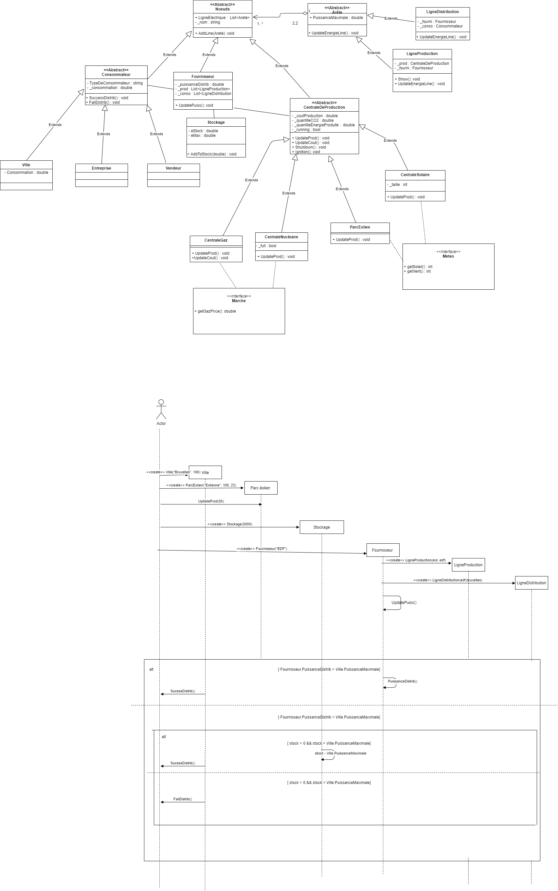

# Programmation Orientée Objet 
## Simulateur de réseaux électriques
### Documentation Technique à destination des chercheurs

Lorsque l'on compile le code de notre programme, une fenêtre s'ouvre et un message nous prévient de la création de noeuds (comme les centrales de production, les consommateurs et le fournisseur) liés à des arêtes (lignes de production, lignes de distribution). Ce message est également accompagné d'une indication pour lancer la simulation. On nous demande d'appuyer sur une touche du clavier pour lancer la simulation. 
Nous appuyons sur la barre d'espace et la simulation se lance véritablement.
La simulation se met à jour toutes les 2 secondes.

Cette simulation de réseaux électriques comprend une gestion des marchés (avec les coûts de production), une gestion de la météo, une gestion de stockage.
La gestion des marchés consiste à rapporter combien consomme les consommateurs (ville, entreprise, vendeurs d'électricité à l'étranger) et surtout combien cela coûte pour les fournir en électricité.
La gestion météo calcule à la fois la force du vent pour la centrale Parc éolien et l'ensoleillement pour la centrale Solaire. S'il y a du vent alors la centrale Parc éolien peut se mettre en route et peut alors produire de l'énergie et de la même manière, s'il y a du soleil, alors la centrale Solaire peut fournir de l'énergie aux consommateurs.

Nous avons également mis en place un mode qui permet de contrôler les sources d'énergie. Ce mode permet d'éviter qu'il y ait des centrales de production qui soient en marche inutilement: notre simulation nous montre que certaines centrales s'éteignent en fonction des besoins des consommateurs ou bien elles peuvent se mettre en fonctionnement s'il manque de l'énergie pour satisfaire leurs besoins. Il y a donc un message permettant de savoir quels consommateurs ont été correctement fournis en énergie et s'ils en ont eu suffisamment ou pas et la simulation affiche également quelles centrales sont en marche et lesquelles sont éteintes. 

La simulation affiche combien d'énergie a été produite au total (cette quantité correspond donc à l'énergie qui va pouvoir être distribuée sur la simulation actuelle par le fournisseur aux consommateurs) et la puissance restante correspond à la puissance après la distribution.

Pour la gestion du stockage, le fournisseur distribue l'énergie nécessaire aux consommateurs mais il peut en rester. Cette énergie ne disparaît pas mais est "stockée". Les batteries ont en réserve une certaine quantité d'énergie.

